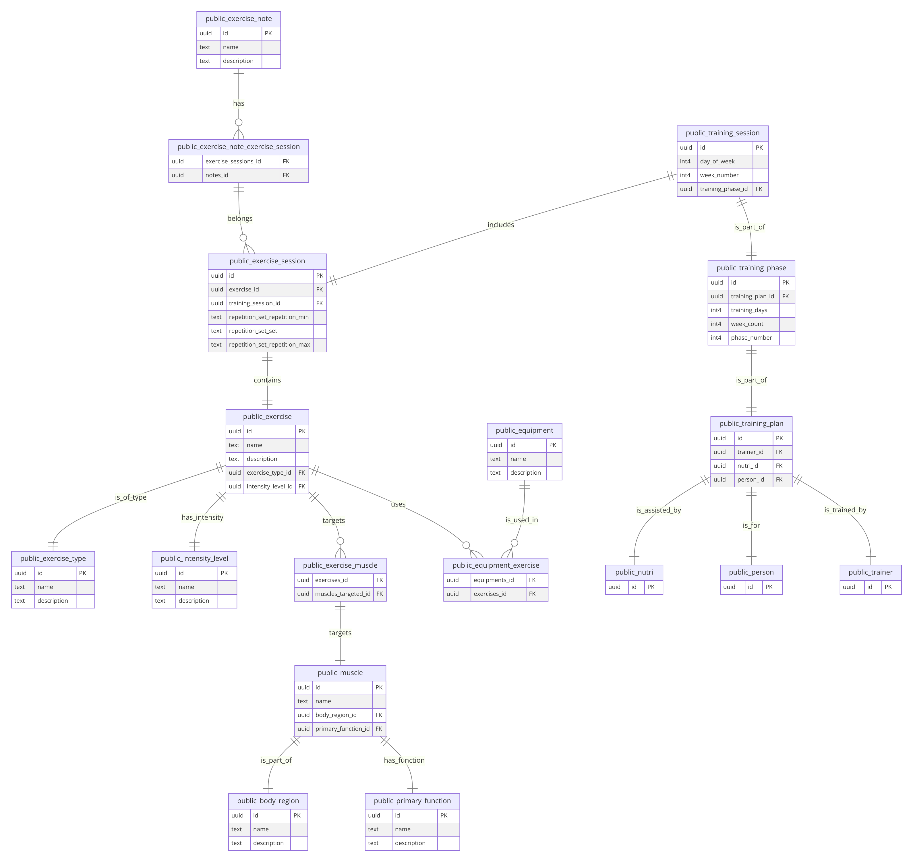

# FitTrackr

## Descrição do Projeto

**FitTrackr.Api v1** é uma Web API desenvolvida utilizando o framework .NET 8. Esta API é projetada para suportar um sistema de gerenciamento de treinamentos físicos, abrangendo funcionalidades relacionadas a usuários, planos de treinamento, sessões de treino, exercícios e mais. O sistema é estruturado para permitir a criação, atualização, exclusão e consulta de dados de diversas entidades que compõem um plano de treinamento físico completo.

A API oferece endpoints organizados em diferentes categorias principais, como Usuários, Planos de Treinamento, Fases de Treinamento, Sessões de Treinamento, Exercícios e Tipos de Exercícios, entre outros. Estes endpoints fornecem operações CRUD (Create, Read, Update, Delete) para gerenciar as informações necessárias para construir e acompanhar programas de treinamento físico personalizados.

### Principais Funcionalidades:
- **Gerenciamento de Usuários**: Cadastro e consulta de usuários.
- **Planos de Treinamento**: Criação, atualização, exclusão e consulta de planos de treinamento e suas fases.
- **Sessões de Treinamento**: Consulta de sessões de treinamento por planos, fases, semanas e dias específicos.
- **Exercícios**: Criação, atualização, exclusão e consulta de exercícios e sessões de exercícios.
- **Equipamentos**: Gerenciamento de equipamentos usados nos treinamentos.
- **Níveis de Intensidade, Tipos de Exercícios e Notas**: Configuração de níveis de intensidade, tipos de exercícios e adição de notas às sessões de exercícios.

## Modelo Relacional

Este modelo relacional representa a estrutura de dados do FitTrackr, uma aplicação que gerencia planos de treinamento físico. O modelo foi desenvolvido utilizando a abordagem Code-First com o Entity Framework Core (EF Core). A abordagem Code-First permite definir o modelo de dados utilizando classes C#, que são posteriormente traduzidas em um esquema de banco de dados relacional pelo EF Core. Esta abordagem facilita a manutenção do código e a evolução do modelo de dados ao longo do tempo.

### Componentes do Modelo

- **TrainingPlan**: Representa um plano de treinamento que agrupa várias fases de treinamento.
- **TrainingPhase**: Cada plano de treinamento é dividido em fases, que são compostas por sessões de treinamento. A entidade TrainingPhase possui informações como número de semanas, dias de treinamento e sessões de treinamento associadas.
- **TrainingSession**: Representa uma sessão de treinamento específica dentro de uma fase de treinamento. Cada sessão está associada a um dia da semana e possui um conjunto de exercícios.
- **ExerciseSession**: Detalha os exercícios realizados em uma sessão de treinamento, incluindo o nome do exercício, o conjunto de repetições e anotações associadas.
- **Exercise**: Representa os exercícios disponíveis no sistema, com detalhes como nome, descrição e tipo de equipamento necessário.
- **ExerciseNote**: Contém anotações específicas para um exercício, que podem ser associadas a várias sessões de exercícios.

### Relacionamentos

- **TrainingPlan** possui múltiplas **TrainingPhases**.
- **TrainingPhase** possui múltiplas **TrainingSessions**.
- **TrainingSession** possui múltiplas **ExerciseSessions**.
- **ExerciseSession** está associada a um **Exercise** e pode ter múltiplas **ExerciseNotes**.

### Diagrama Relacional



Este diagrama ilustra as entidades e os relacionamentos entre elas, proporcionando uma visão clara da estrutura de dados do FitTrackr.

A utilização do EF Core com abordagem Code-First permite uma evolução contínua do modelo de dados, facilitando a manutenção e a escalabilidade da aplicação FitTrackr.

### Configuração do Banco de Dados Localmente via Code First com Entity Framework Core

Este guia rápido irá ajudá-lo a configurar o banco de dados localmente em uma nova máquina utilizando o Entity Framework Core e PostgreSQL. Este tutorial assume que todas as migrações já estão criadas e os pacotes necessários estão instalados no projeto.

### Pré-requisitos

- **Docker** instalado.
- **.NET 8.0** ou superior instalado.

### Configuração de Conexão

Certifique-se de que a string de conexão do banco de dados está corretamente configurada no seu `appsettings.json` com o `Host` setado como *localhost*:

```json
{
  "ConnectionStrings": {
    "Database": "Host=localhost;Port=5432;Database=fittrackr;Username=postgres;Password=postgres;Include Error Detail=true"
  }
}
```

### Configuração via Console do Gerenciador de Pacotes (Package Manager Console)

1. **Abrir o Console do Gerenciador de Pacotes**:

   No Visual Studio, vá para **Ferramentas** > **Gerenciador de Pacotes NuGet** > **Console do Gerenciador de Pacotes**.

2. **Selecione o Projeto Default**:

   No Console do Gerenciador de Pacotes, em `Default Project` selecione o projeto **Infrastructure**.

3. **Selecione o Startup Project**:

   No Visual Studio, em `Startup Project` selecione o projeto **Web.Api**.

3. **Atualizar o Banco de Dados**:

   No Console do Gerenciador de Pacotes, execute o comando abaixo para aplicar as migrações existentes ao banco de dados:

   ```powershell
   Update-Database
   ```

Com esses passos, você deve estar apto a configurar o banco de dados localmente em uma nova máquina usando a abordagem Code First com Entity Framework Core e PostgreSQL.